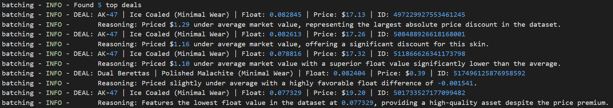

# Cs2 Skin Scraper
## 🌟 Highlights
Here are some of the main features of this `CS2` Skin Scraper:
- Tracks any `CS2` skin listed on the `Steam Community Market`.
- Gathers all listings of tracked `CS2` skins that meet a maximum float and maximum price.
- Determines best deals out of gathered listings using `Gemini API`.
- Solves the time-consuming process of sifting through Steam Community Market listings and determining profitable skin purchases.
## ℹ️ Overview
Hi, I'm Charles the creator of this CS2 Skin Scraper. I built this system as an automated replacement for some of the manual, laborious and time-consuming work that I would do in my High School years. I would have multiple Steam Community Market tabs open at the same time, refreshing them periodically throughout the day hoping to find some listings with good prices and float values. Recognizing the perfect opportunity for automation, I decided to design this Asynchronous Producer Consumer Pipeline that would help me do these tasks.

### How it works
As of this version, the CS2 Skin Scraper has 3 main components:
1. Multiple Scraping Loops (Producer) which work through messy `Steam Community Market` data and write valid listings into a SQLite3 Database. 
2. A SQLite3 database using Write Ahead Logging (WAL) for handling high-frequency writes, which are necessary to support the multiple scraping loops.
3. A Batch Analysis Loop (Consumer) which pulls data from the database, processes it and feeds it to Gemini in an engineered prompt to return the top 10 best deals of the current batch.

### Example output


## ⚙️ Usage
Currently, the script can be run through the tracker.py file. It currently provides the user with 3 commands, `add`, `remove` and `continue`.

`add` allows you to add additional skins into the list of skins being tracked. You will be prompted for maximum float and maximum price.

`remove` allows you to remove specific skins from the list of skins being tracked. This can be done using the id of the skin within the tracked list.

`continue` heads past the add and remove phase to begin the tracking and batch analysis. 

```python
python tracker.py 
```

## ⬇️ Installation

```bash
python -m venv .venv
.venv\Scripts\activate
pip install -r requirements.txt
```

### Create a `.env` with
```
STEAM_USER_AGENT=<your-user-agent>
SESSION_ID_FALLBACK=<your-session-id>
GEMINI_API_KEY=<your-api-key>
GEMINI_MODEL=gemini-3.1-flash-lite
```

## Feature Ideas
